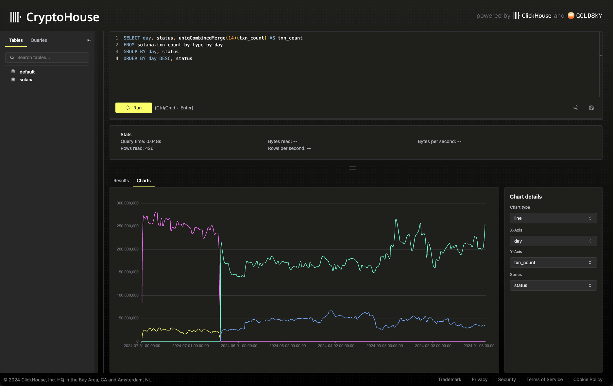

# CryptoHouse

This repository contains the example queries and materialized views used for [CryptoHouse](https://crypto.clickhouse.com). Users can raise UI issues in this repository, request Materialized views, and suggest example queries.

**The process to deploy example queries and materialized views is currently manual. We intend to automate this process.**

## Contributing example queries

Fork this repository and raise a PR on the [queries.json](./queries.json) file. Once the PR is approved, this query will be deployed to the ClickHouse instance (currently manually).

## Reporting UI or Performance issues with CryptoHouse

Raise an issue in this repository using the relevant template.

## Requesting a Materialized View

Materialized views can be used to accelerate specific queries. We will consider adding materialized views if they are generic and can be used across a number of queries. Please raise a "Request Materialized View" issue in this repository.
